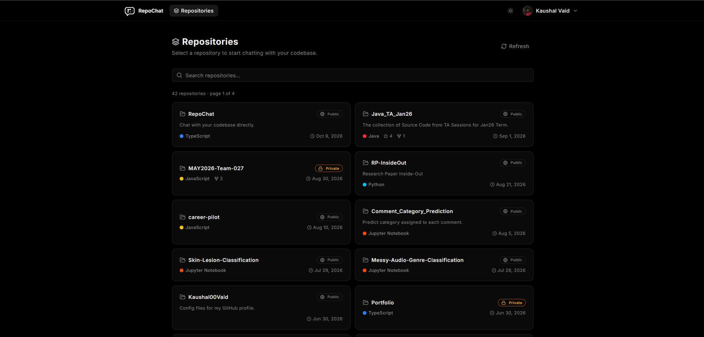
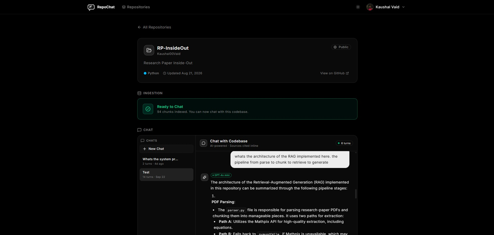
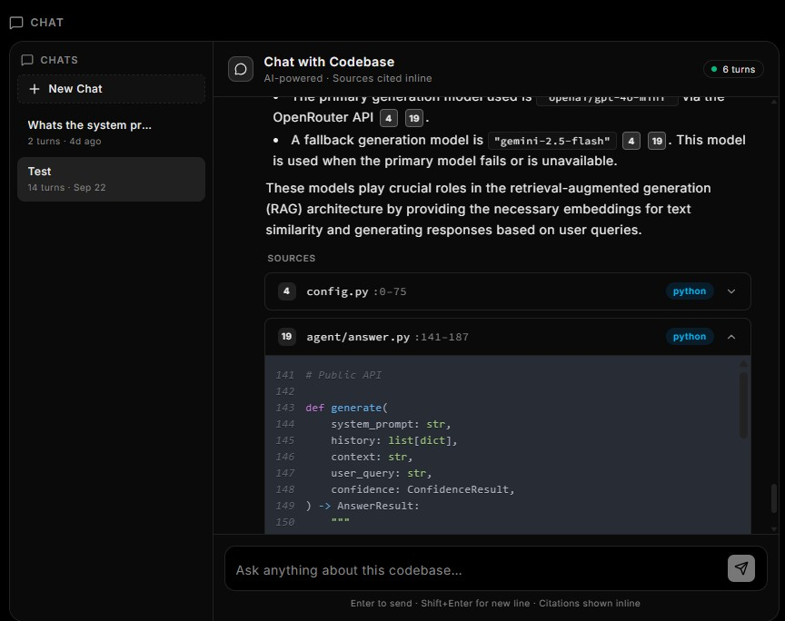
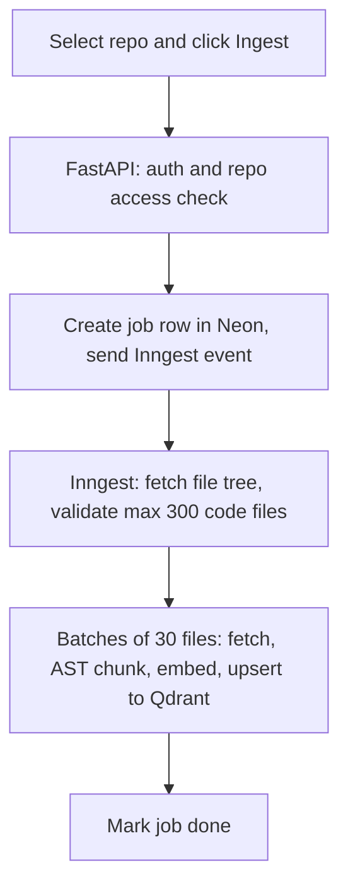
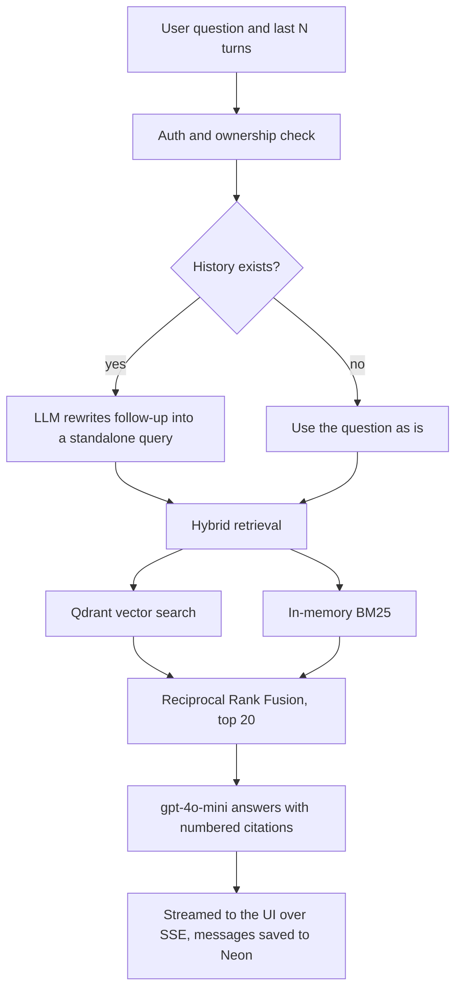

# RepoChat

Chat with your codebase. Sign in with GitHub, pick a repository, ingest it, and ask questions in plain English. Answers stream back with numbered citations that open the exact file and line range they came from.

[Live](https://repo-chat-sand.vercel.app/) | Built by Kaushal

<video controls src="assets/demo.mp4" title="Demo Video"></video>

<table>
  <tr>
    <td width="50%"></td>
    <td width="50%"></td>
  </tr>
  <tr>
    <td width="50%"></td>
    <td width="50%"></td>
  </tr>
</table>

## What it does

- GitHub OAuth sign-in with a persistent session (JWT in an httpOnly cookie)
- Lists your repositories, public and private, and ingests the one you pick as a background job with live progress
- Hybrid retrieval: dense vector search plus BM25 keyword search, fused with Reciprocal Rank Fusion
- Stateful conversational RAG: a follow-up like "what about its caller?" is rewritten into a standalone query before retrieval
- Streaming answers with numbered citations that expand into the cited code chunk (file path and line range)
- Multiple saved conversations per repository, which you can rename, resume later, or delete
- Prompt-level guardrails: answers only from retrieved code, refuses off-topic and override attempts

Supported languages: Python, JavaScript, TypeScript. Limits: up to 300 code files per repository, files under 500 KB.

## Try it

Start with a repository you know well, then ask something like:

- "Walk me through how ingestion works"
- "Where is authentication handled?"
- "Which external APIs does this integrate with?"
- A follow-up that depends on the previous answer: "Does it retry on failure?"

If you would rather not connect a private repository, try a public one first (see [Data and privacy](#data-and-privacy)).

## Architecture

### Ingestion



The frontend polls the job status every 2 seconds and shows progress until the repository is ready to chat.

### Question answering



## Tech stack

| Layer | Technology |
|---|---|
| Frontend | React, TypeScript, shadcn/ui |
| Backend | FastAPI, SQLAlchemy |
| Background jobs | Inngest |
| Relational data | Neon Postgres (users, ingestion jobs, conversations, messages) |
| Vector store | Qdrant Cloud (vectors plus chunk payloads) |
| Parsing | tree-sitter (Python and JavaScript grammars, TypeScript through the JavaScript grammar) |
| Embeddings | text-embedding-3-small via OpenRouter, 1536 dimensions |
| LLM | gpt-4o-mini via OpenRouter, Gemini 2.5 Flash as fallback |
| Hosting | Vercel (frontend and backend), Vercel Cron |
| CI | GitHub Actions |

## Key design decisions

**AST chunking with gap filling.** Files are parsed with tree-sitter and split at top-level function and class boundaries. Everything between those nodes (imports, constants, prompt strings, comments) is kept as well. Small neighbors merge up to 60 lines, large non-code blocks become their own chunks, tiny tails are absorbed into the previous chunk, and any chunk over 20,000 characters is split on line boundaries to stay under the embedding model's 8,192-token input limit. The first version only emitted functions and classes, which silently dropped module-level constants such as prompt strings.

**Hybrid retrieval with RRF.** Embeddings capture intent ("how does auth work") but are weak on exact identifiers such as `getUserById`. BM25 with a tokenizer that splits camelCase and snake_case covers that case. Qdrant has no native BM25, so a repository's chunk payloads are loaded and scored in memory per query, which is acceptable because of the 300-file cap. Each ranker over-fetches 2x, and Reciprocal Rank Fusion (k = 60) merges the two lists into the final top 20.

**Query condensation for stateful chat.** On turn 2 and later, a short LLM call rewrites the follow-up into a standalone query using recent history. The rewritten query goes to retrieval; the original question plus history goes to generation. Only the last 12 messages (six exchanges) are loaded and sent, which keeps long conversations cheap and condensation accurate.

**Durable ingestion.** Ingestion runs as an Inngest function. Inngest replays the function on every step, so every side effect, including database writes, lives inside a step. Work is split into batches of 30 files per step and each step returns only counts, because a single step returning every chunk would exceed the roughly 4 MB step-output limit on large repositories.

**Prompt-level guardrails.** Topic lock, fixed refusal phrases, no system-prompt disclosure, and a 1,000-character query cap. A classifier library such as llm-guard is the more robust option, but it needs PyTorch plus a model of about 300 MB, which does not fit the serverless deployment, and the threat model of a small demo does not justify it. Tested manually against override and off-topic prompts.

**Per-user scoping.** Ingest, retrieval, chat and conversation requests are authenticated and checked against the caller's own jobs and conversations. Qdrant searches are additionally filtered by repository.

## Deployment

- The frontend and backend are separate Vercel projects. The frontend proxies `/api/*` to the backend with a rewrite, so the browser sees a single origin and the httpOnly cookie works.
- A Vercel Cron job calls a secret-protected endpoint daily at 03:00 UTC to keep the free-tier Qdrant cluster from being suspended for inactivity.
- CI (GitHub Actions) runs `ruff` and `pytest` on the backend and `eslint`, `tsc` and a build on the frontend. Vercel's Git integration handles deploys.

## Running locally

You need accounts or keys for: Neon Postgres, Qdrant Cloud, OpenRouter, Google AI Studio (Gemini), and a GitHub OAuth app whose callback URL is `<backend>/auth/github/callback`. Variable names are listed in `.env.example`.

```bash
# backend
cd backend
python -m venv .venv
source .venv/bin/activate        # Windows: .venv\Scripts\activate
pip install -r requirements.txt
uvicorn main:app --reload --port 8000

# Inngest dev server (second terminal)
npx inngest-cli@latest dev

# frontend (third terminal)
cd frontend
npm install
npm run dev
```

The Inngest dev server finds the backend at `http://localhost:8000/api/inngest`.

## Known limitations

- **Embedding fallback.** If the primary embedding provider is unavailable, ingestion falls back to Gemini. Vectors from different models are not comparable, so a repository ingested during a fallback can retrieve worse. Planned fix: record the embedding provider per ingestion job and embed queries with the same one.
- **No retrieval evaluation yet.** Retrieval quality has been checked by hand across several repositories, not measured. A labeled query set is planned.
- **Top-level chunking only.** Functions nested inside other constructs are not chunked on their own, and TypeScript-specific syntax is parsed with the JavaScript grammar.
- **Oversized chunks** are split on line boundaries, which can cut through the middle of a very large class or function.
- **BM25 corpus is not cached.** It is reloaded from Qdrant on every query, which is fine at the 300-file cap but would not scale to large repositories.
- Hosted on free tiers, so heavy traffic may hit rate limits.

## Upcoming Plans

- Paste any public repository URL to ingest it without OAuth
- Bring your own API key (BYOK)
- Per-job embedding provider tracking
- Retrieval evaluation set
- Optional reranking

## Data and privacy

When you ingest a repository, its code chunks are stored in Qdrant and sent to OpenRouter for embedding. Your questions and the retrieved chunks are sent to the LLM provider (OpenRouter, or Google Gemini if the primary is unavailable). Conversation history is stored in Neon and deleted when you delete the conversation. If you are unsure, try a public repository first.

## Author

Built by Kaushal. [LinkedIn](https://www.linkedin.com/in/kaushal-vaid/) | [GitHub](https://github.com/Kaushal00vaid)